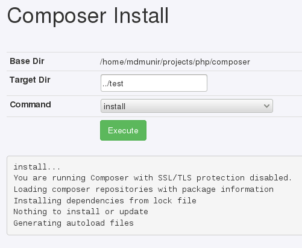
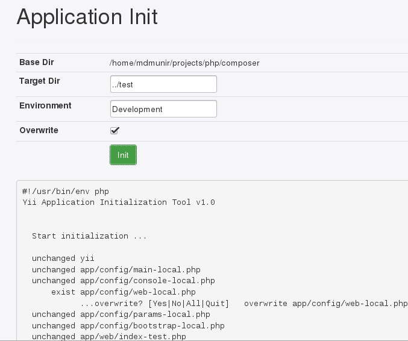

Composer Web Application
========================

Allow execute composer command (`install`, `update`) from browser. This application include `fxp/composer-asset-plugin`.

Installation / Usage
--------------------

1. Download from [here](https://github.com/deesoft/composer/archive/master.zip).
2. Extract then upload to your hosting.
3. Upload your project that contain `composer.json` or `composer.lock` to your hosting without vendor folder.
4. Open application from browser at `http://yourhosting.com/composer/index.php`

5. To initialize application (`yii2-app-advanced` template). Open `http://yourhosting.com/composer/index.php?app=init`

